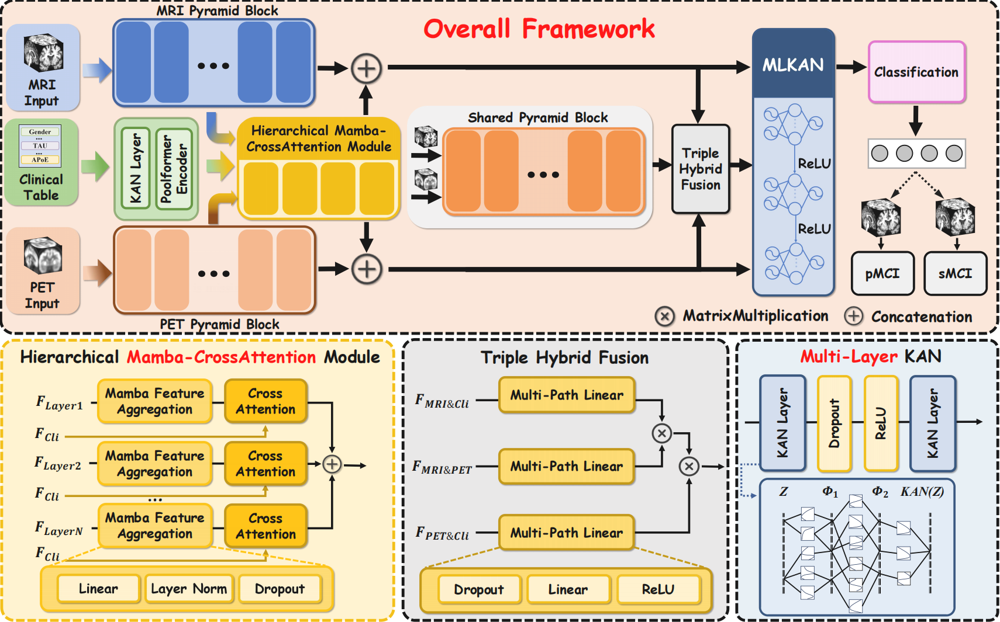

# IHFNet: Incomplete Multimodal Hierarchical Feature Fusion Network for Mild Cognitive Impairment Conversion Prediction


-----

## 1 Paper flowchart




## 2 Source Tree

```
├── /Net
│   ├── api.py
│   ├── basic.py
│   ├── kan.py
│   ├── MultiLayerFusion.py
│   ├── poolformer.py
│   ├── ResnetEncoder.py
├── Config.py
├── Dataset.py
├── loss_function.py
├── main_rebuild.py
├── observer.py
├── README.md
├── utils.py
```

## 3 Dataset

### 3.1  Introduction

The dataset for this study is obtained from the Alzheimer's Disease Neuroimaging Initiative (ADNI), specifically the ADNI-1 and ADNI-2 cohorts. To prevent duplication, subjects present in both datasets were removed from ADNI-2. We selected T1-weighted sMRI, FDG-PET, and clinical data, categorized into four groups: normal controls (NC), sMCI, pMCI, and AD. Demographic information of the dataset is shown in Table below. Additionally, PET data is missing for 82 pMCI and 95 sMCI cases in ADNI-1, and for 1 pMCI and 30 sMCI cases in ADNI-2.

The ADNI dataset link: [ADNI | Alzheimer's Disease Neuroimaging Initiative](https://adni.loni.usc.edu/)

### 3.2 Dataset Split Principle

We employ a `5-fold cross-validation` strategy to ensure robust model evaluation. The dataset is split into training (80%) and validation (20%) subsets, maintaining an equal proportion of each class.

## 4 Training Process

### 4.1 Environment Setup

Please create a new virtual environment, then run the following code to install the necessary library.

```shell
pip install -r requirements.txt
```

### 4.2 Hyperparameter setting

- PyTorch version: `2.6.0` with CUDA `11.8`
- GPU: `Nvidia V100 32GB`
- Training: `Two-stage training` (each stage with `150 epochs`)
- Batch size: `8`
- Optimizer: `AdamW`
- Learning rate: `0.001`
- Scheduler: `Cosine Annealing` with `T_max=50`

### 4.3 training step

1. Download and preprocess the ADNI dataset, including MRI, PET, and clinical modalities
2. Place the data in the following folder structure:

```
.
├── /ADNI1/MRI/
│   ├── xx.nii
│   ├── xx.nii
│   └── ....
├── /ADNI1/PET/
│   ├── xx.nii
│   ├── xx.nii
│   └── ...
└── clinical.csv
└── ...
└── ...

```

3. Modify `Config.py` to specify dataset paths.

4. Run the training script:

```shell
python main_rebuild.py
```


## 5 Example Data for Inference

We provide sample MRI and PET images in `example_data/` for quick inference testing:

```
example_data/
├── test_mri.nii
├── test_pet.nii

```

Please Run:

```shell
python inference.py 
```

Due to the sensitive information contained in clinical data, it is not provided here, only as an example in the code

## 6 Pretrained Model

A pretrained model is available for inference. 

Download it from [pretrainedModel Link](https://pan.baidu.com/s/1dKFYZZUZA3lV-WDIRPyrLQ) Extract code: fjyq

